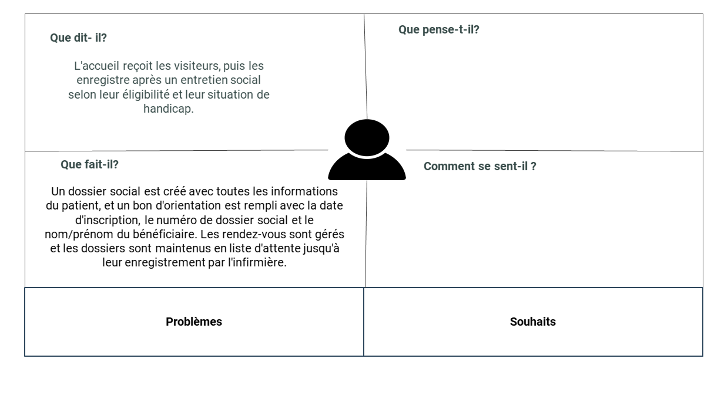
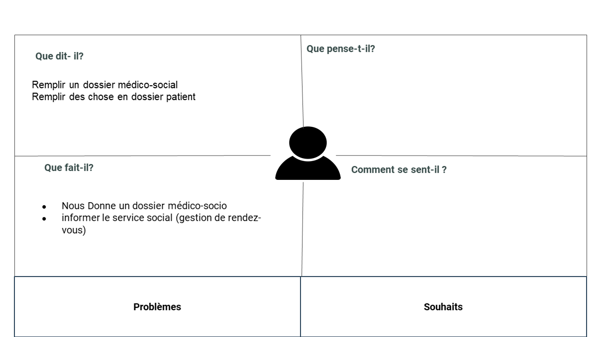
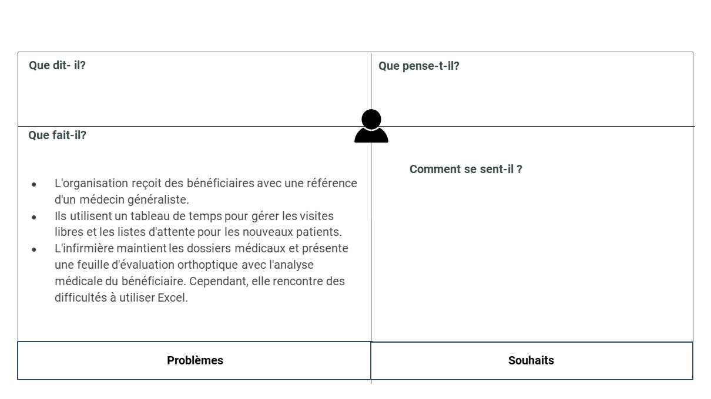
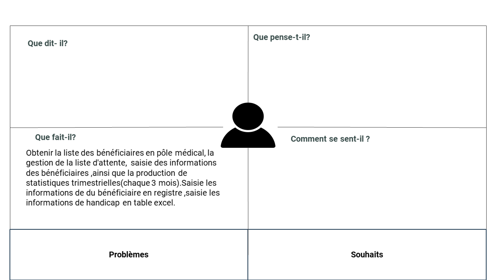
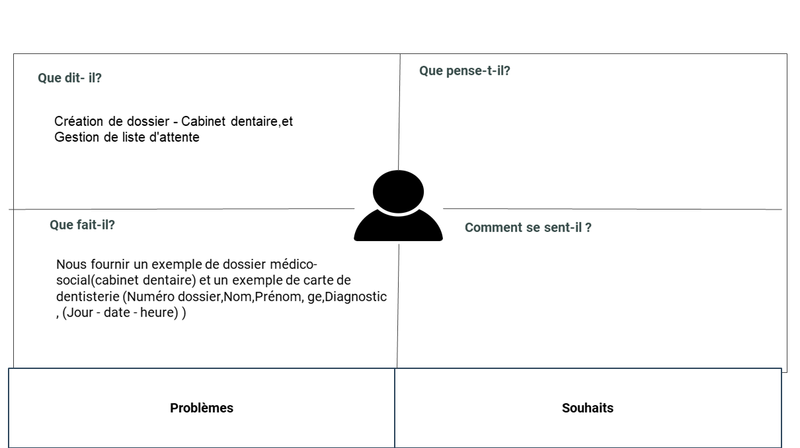
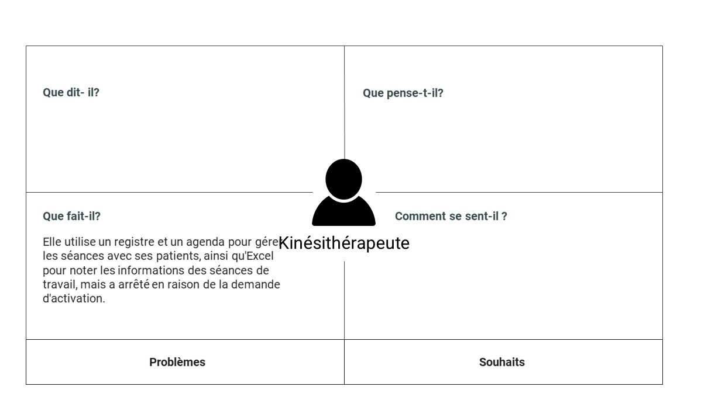
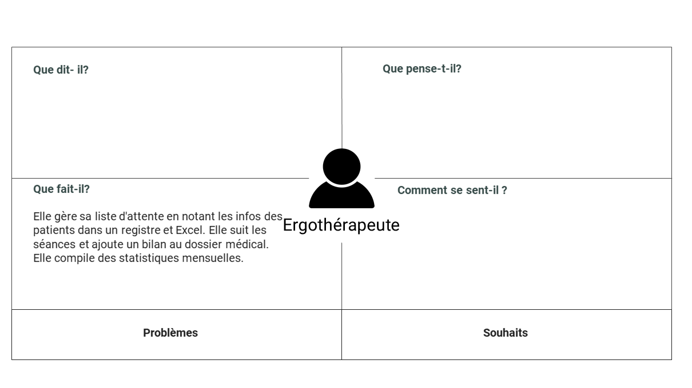
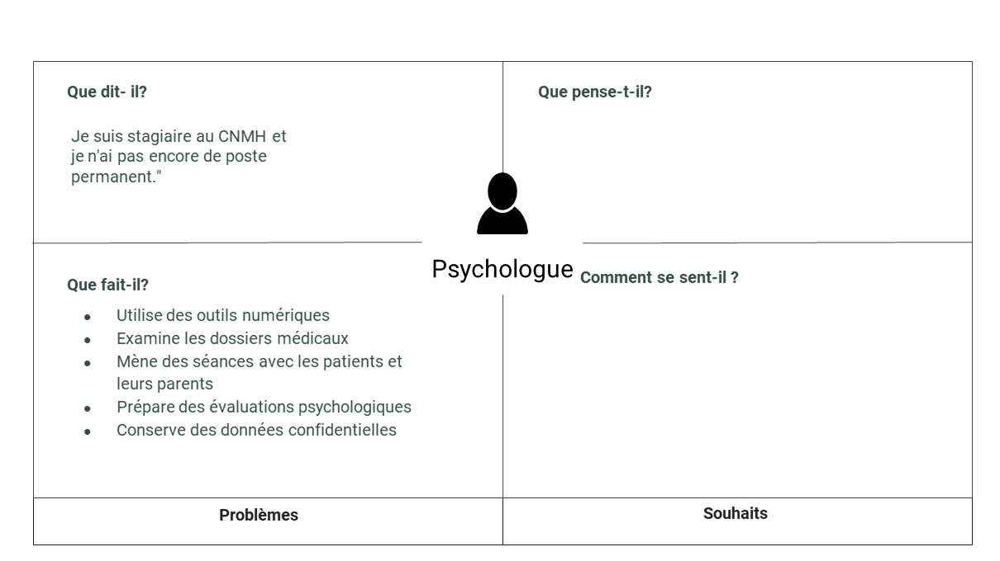
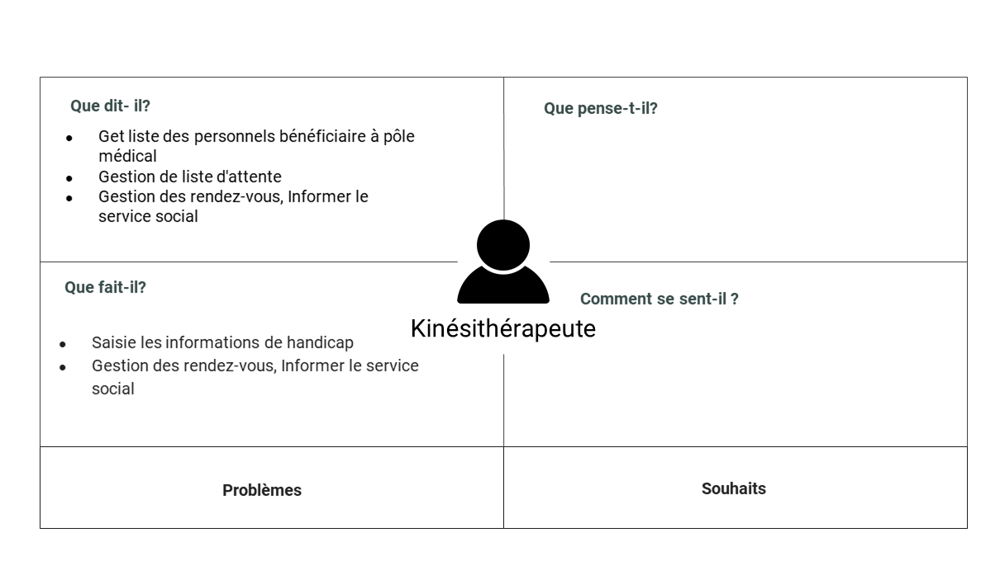
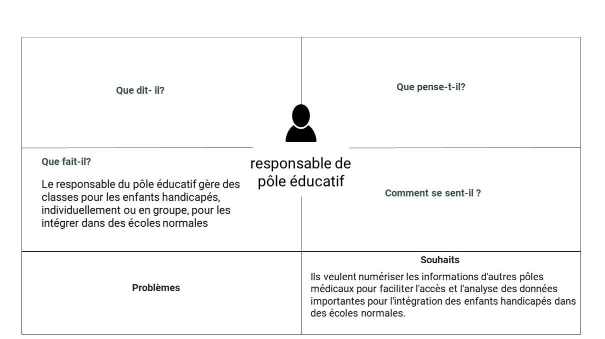

# Empathie

## Introduction 

## Service Social - Khawla souan 

### Persona
Khawla souan

### Ce qu'il dit 
- a  l’accueil ( réception au visiteur de centre - repondre a leurs questions)
- après entretien social ils l'enregistrent ou pas  selon leur condition (est ce qu'ils ont une handicapé ou pas) création de dossier social(tout les informations du patient avec N°A…) 
- remplir bon d’orientation(date inscription,Dossier social N°A…,Nom et Prénom du bénéficiaire)
- Gestion des rendez-vous
- dossier ça reste en liste d’attente enregistrement
- dossier va passer à l'infirmière
### Faire
Affiche les information en table exel :
- N dossier
- Nom
- Prénom
- Sexe
- TH
- Date naissance
- Age
- Couverture médicale
- cnops
- cnss
- ramed
- assurance
- FAR
- Sans
- Date enregistrement
- Date entrée

## Médecin général Algamot asia

### Persona
Algamot asia

#### Ce qu'il dit : 
- Elle dit que en tant qu'infirmière en médecine générale, elle doit accomplir plusieurs tâches,  notamment : 
- Remplir un dossier médico-social 
- Mise en charge (date inscription,nom prénom,numéro dossier,conclusion clinique,orientation)
- Remplir des chose en dossier patient
- Après envoyé dossier à médecine pour continuer la remplir de dossier
### Ce qu’il fait :
- Apprendre à travailler avec Excel afin d'améliorer la façon dont elle insère les données
- Nous Donne un dossier médico-socio 
## D’empathie d’orthoptiste - Imane Errahmouni

### Persona
Imane Errahmouni

#### Ce qu'il dit : 
- nous recevons les bénéficiaires accompagnés de leur bon d’orientation suivi par le médecin généraliste.
- à l'aide d'un tableau de temps composé de deux parties :
- une pour les bénéficiaires en visite libre sans rendez-vous.
- la seconde pour que les nouveaux soient mis sur la liste d'attente et appelés par le service social.
- le dossier médical est gardé par l'infirmière pour consigner les données,
- nous présentons une feuille dite <<BILAN ORTHOPTIQUE>>  décrivons les données et l'analyse médicale du bénéficiaire.
- au début elle gère ce tableau sur papier  puis elle a switché vers l'outil Excel, or elle trouve des difficultés à travailler avec ce dernier

### Ce qu’il fait : 
- Numéro d’ordre 
- Date
- Numéro dossier 
- ACTES RELISES
- BILAN ORTHOPTIQUE
- NV CAS
- ANC CAS
- TRAITEMENT D’AMBLYOPIE
- REEDUCATION ORTHOPTIQUE
- CHAMP VISUEL
- AUTRES
- ACTES NON REALISES
- ABSENCE
- NON COOPERANT 
- AUTRE
- OBSERVATION
- RH

## Psychomotricien - Salma LIKRAM

### Persona
SALMA LIKRAM

#### Ce qu'il dit : 
- prendre liste des personnels bénéficiaire à pôle médical
- Gestion de liste d'attente 
  - Gestion des rendez-vous
  - Informer le service social
- Statistique pour chaque 3 mois en table exel

### Ce qu’il faire :
- Saisie les informations de handicap
  - N° du dossier
  - Nom et Prénom
  - Pathologies/houbles
  - Observation
- Saisie les informations de handicap en table excel
  - Date d’entrée
  - N° du dossier
  - Nom et Prénom
  -  Age
  - Diagnostic
  - Présence avec date et nb séance
  - Remarque

## Assistant dentaire spécialiste Interne - Tallaoui sanae

### Persona
Tallaoui sanae

#### Ce qu'il dit:
- Création de dossier - Cabinet dentaire
  - Numéro d’ordre 
  - Numéro dossier 
  - Nom
  - Prénom
  - Date de Naissance
  - N° de téléphone
  - Diagnostic
  - Activité dentaire
- Gestion de liste d'attente 
  - Gestion des rendez-vous
  - Informer le service social

### Ce qu’il faire:
- Nous fournir un exemple de dossier médico-social(cabinet dentaire)+ un exemple de carte de dentisterie (Numéro dossier,Nom,Prénom, ge,Diagnostic , (Jour - date - heure) )
## Service de rééducation - Kinésithérapeute - Nassima El Ouazzani

### Persona
Nassima El Ouazzani

#### Ce qu'il dit : 
- Elle utilise différentes méthodes pour gérer son travail.
- Elle utilise un registre dans lequel elle note le numéro d'ordre général depuis qu'elle a commencé à travailler, le numéro d'ordre annuel, la date de visite, le nom et prénom du patient, le type de handicap, le numéro de téléphone, le numéro de dossier et ses observations.
- Elle utilise également un agenda pour gérer les séances avec les patients.
- Elle a commencé à travailler sur Excel pour noter la date, le numéro de dossier, la séance de bilan, le compte rendu du bilan (fait ou en attente), le numéro de la séance de travail, le compte rendu final, le taux de réalisation des objectifs et le nom du kinésithérapeute.
- Cependant, elle a arrêté d'utiliser Excel en raison de la demande d'activation.
 
## Service de rééducation - Ergothérapeute - Alaoui Ghita

### Persona 
Alaoui Ghita

#### Ce qu'il dit : 
- Pour créer sa propre liste d'attente, elle commence par aller voir l'infirmière généraliste et note dans un registre le numéro de dossier, le nom, le prénom, la date de naissance et le numéro de téléphone des bénéficiaires sur la liste d'attente.
- Elle utilise Excel pour enregistrer des informations telles que la date, le numéro d'ordre d'appel, le numéro d'ordre de la séance, le numéro de dossier, le nom et prénom du patient, le diagnostic, le type de séance, le numéro de la séance, la présence (après 3 absences injustifiées, le patient retourne sur la liste d'attente) et ses observations.
- Après avoir mené ses séances, elle ajoute un bilan dans le dossier médical du patient.
- Elle écrit également des statistiques mensuelles sur un petit papier, notamment le nombre total d'actes, le nombre total d'absences, le nombre total de cas pris en charge (PEC) et le nombre total d'orientations.

## Service de rééducation - Psychologue - Anas Mjadli

### Persona 
Anas Mjadli

#### Ce qu'il dit : 
- Le psychologue est nouveau dans le centre CNMH et n'est pas encore un employé permanent.
- La première fois qu'il travaille avec un patient, il examine son dossier médical.
- Son rôle consiste à effectuer des séances avec les parents et les patients du centre.
- Après avoir mené les séances et tiré ses conclusions, il établit un bilan psychologique sur le patient.
- Il garde beaucoup de données confidentielles en raison de la nature de son travail et des sujets personnels qu'il discute avec les patients.
- Il n'a aucun problème à gérer son travail et n'est pas encore tenu de fournir des chiffres pour les statistiques.
- Il utilise des produits numériques tels que Google Sheets et Google Forms pour gérer son travail, même s'il n'y est pas obligé, pour des raisons d'organisation.

## Service rééducation - orthophoniste - SAMIA KABBAJ 

### Persona
SAMIA KABBAJ

#### Ce qu'il dit : 
- Get liste des personnels bénéficiaire à pôle médical
- Gestion de liste d'attente 
- Gestion des rendez-vous
- Informer le service social

### Ce qu’il faire :
Saisie les informations de handicap
- Date
- N° du dossier
- Nom et Prénom
- Sexe
- Age
- Diagnostic
- Présence
- Nombre de séance->S1

## Pole sport - (Yassine serhane, Karima bamoussa)

.png)

### Persona
Yassine serhane, Karima bamoussa
  
#### Ce qu'il dit : 
- les personnes qui vous bénéficiez des activités sportives doivent venir pour     inscription
- Gestion de liste d'attente 
- Gestion des rendez-vous
- Gestion de l’absence

### Ce qu’il faire :
Table de dossier de l’inscription en excel:
- N° du ordre
- N° du dossier
- Nom et Prénom
- Type d’handicap
- Acte de naissance
- CIN
- Photos
- certificat médical
- Permission parental
- Assurance
- Dossier complet
Saisie les informations de handicap en table excel:
- N° du dossier
- Nom et Prénom
- Age
- Association
- Sexe
- TRA
- Type d’handicap

liste de présence:
- N° d ordre
- N° du dossier
- Nom et Prénom
- Association
- Heure d'entrée
- Sexe
- Type d’handicap

## Responsable de pôle éducatif - Fouad Ichir

### Persona 
Fouad Ichir

#### Ce qu'il dit : 
- Ils ont des classes pour éduquer les enfants handicapés de 6 à 14 ans, individuellement ou en groupe, dans le but de les intégrer dans des écoles normales.
- Ils ont des bénéficiaires fixes et mobiles (les fixes restent dans le centre - les mobiles vont à l'école et parfois au centre).
- Tous ces bénéficiaires fixes et mobiles ont un dossier médical et un dossier au sein du pôle éducatif.
- Lorsqu'ils préparent une décision concernant la capacité d'un enfant à être intégré partiellement (mobile) ou totalement (favorable) dans des écoles normales, ils ont besoin de données provenant d'autres pôles du centre (bilan final des séances médicales / psychologiques effectuées avec les patients).
- Le responsable doit se rendre en personne à ces pôles pour obtenir les informations dont il a besoin et les noter.
- Ils souhaitent que ces informations soient numérisées pour faciliter l'accès et prendre en compte les données importantes telles que l'âge, les dates et l'état médical.
## Références 
[Carte d'empathie](https://docs.google.com/presentation/d/1WkibTkxVvAtEwSUtbnktpjZTRztYOJby6Cckc1bsjlg/edit)

## Conclusion

